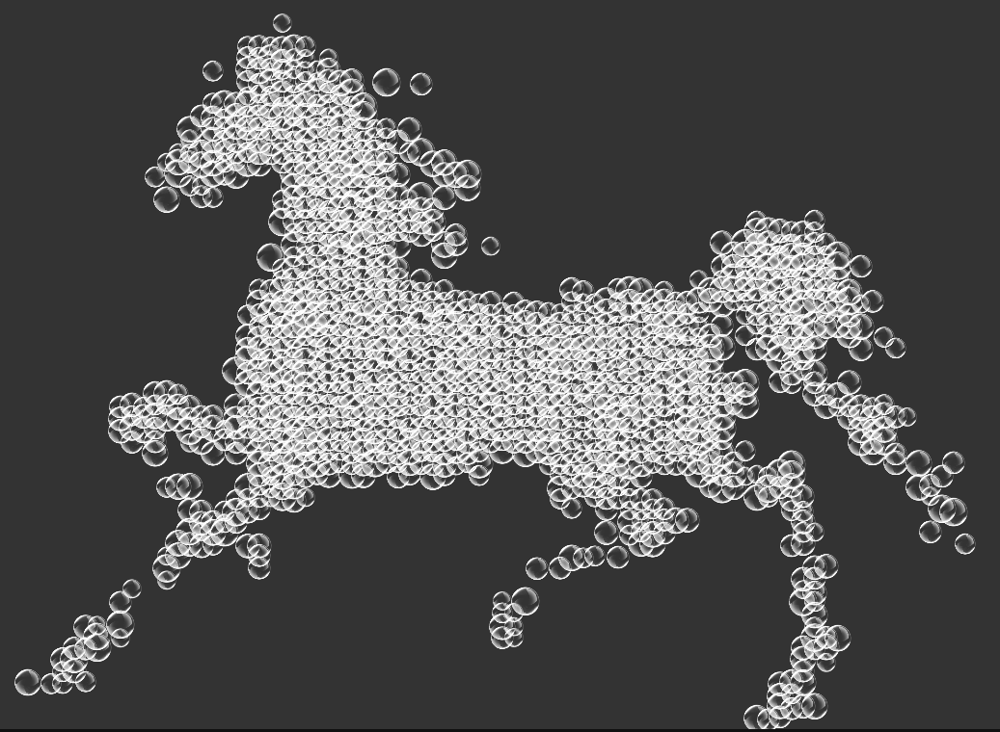

# 绘制马匹



```html
<style>
  html,
  body {
    margin: 0;
    padding: 0;
    background: #333;
  }

  .bubble {
    position: absolute;
    animation-timing-function: linear;
    animation-name: floating;
    animation-iteration-count: infinite;
  }

  @keyframes floating {
    0% {
      transform: translateY(0px);
    }

    50% {
      transform: translateY(-5px);
    }

    100% {
      transform: translateY(0px);
    }
  }
</style>

<div id='container' style="width: 100%;height: 100%;position: absolute;z-index: 2;"></div>
<canvas id='canvas' style="position: absolute;z-index: 1;filter: blur(5px);"></canvas>
```

```js
window.onload = function () {
  const canvas = document.querySelector('#canvas')
  const ctx = canvas.getContext('2d')

  // 绘制图片
  const image = new Image()
  image.src = './ma.png'

  image.onload = function () {
    canvas.width = image.width
    canvas.height = image.height
    ctx.drawImage(image, 0, 0);
    draw()
  }

  // 裁剪图片矩阵
  function draw() {
    // 获取图片矩阵信息
    const imageData = ctx.getImageData(0, 0, image.width, image.height).data
    // 清除掉原有的 canvas image
    ctx.clearRect(0, 0, image.width, image.height);
    // ctx.fillStyle = '#fff'
    // ctx.fillRect(0, 0, image.width, image.height)

    const gap = 6

    const dragonContainer = document.querySelector('#container')
    const dragonScale = 2

    for (let h = 0; h < image.height; h += gap) {
      for (let w = 0; w < image.width; w += gap) {
        const postion = (image.width * h + w) * 4
        const r = imageData[postion]
        const g = imageData[postion + 1]
        const b = imageData[postion + 2]

        if (r + g + b === 0) {
          // ctx.fillStyle = '#000'
          // ctx.fillRect(w, h, 4, 4)

          const bubble = document.createElement('img')
          bubble.src = './bubble.png'
          bubble.setAttribute('class', 'bubble')

          const bubbleSize = Math.random() * 10 + 20
          bubble.style.left = (w * dragonScale - bubbleSize / 2) + 'px'
          bubble.style.top = (h * dragonScale - bubbleSize / 2) + 'px'
          bubble.style.width = bubble.style.height = bubbleSize + 'px'
          bubble.style.animationDuration = Math.random() * 6 + 4 + 's'

          dragonContainer.appendChild(bubble)
        }

      }

    }

  }
}
```

**参考：**

- [产品经理：你能不能用div给我画条龙？](https://juejin.cn/post/6963476650356916254#heading-6)